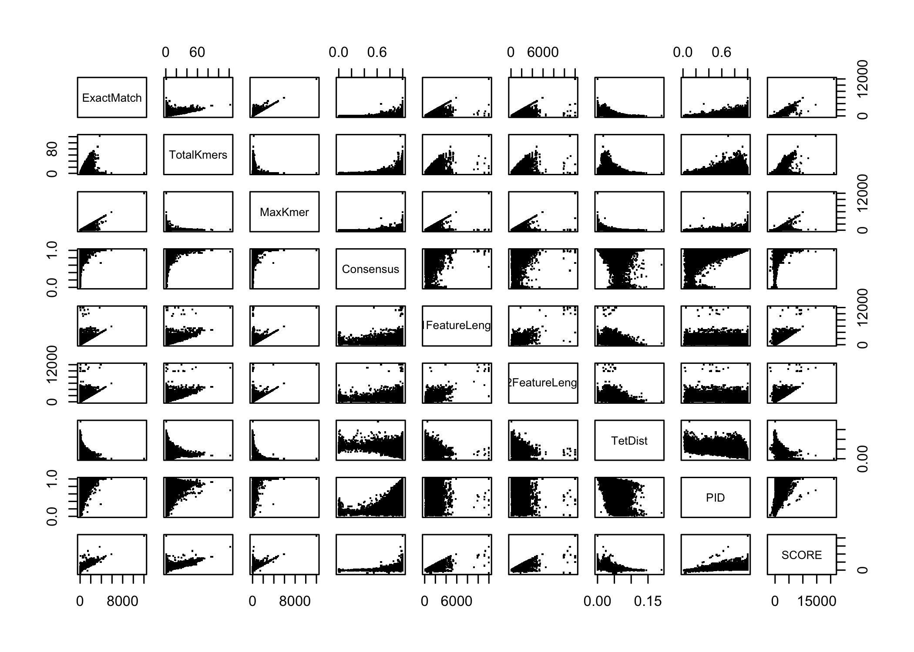
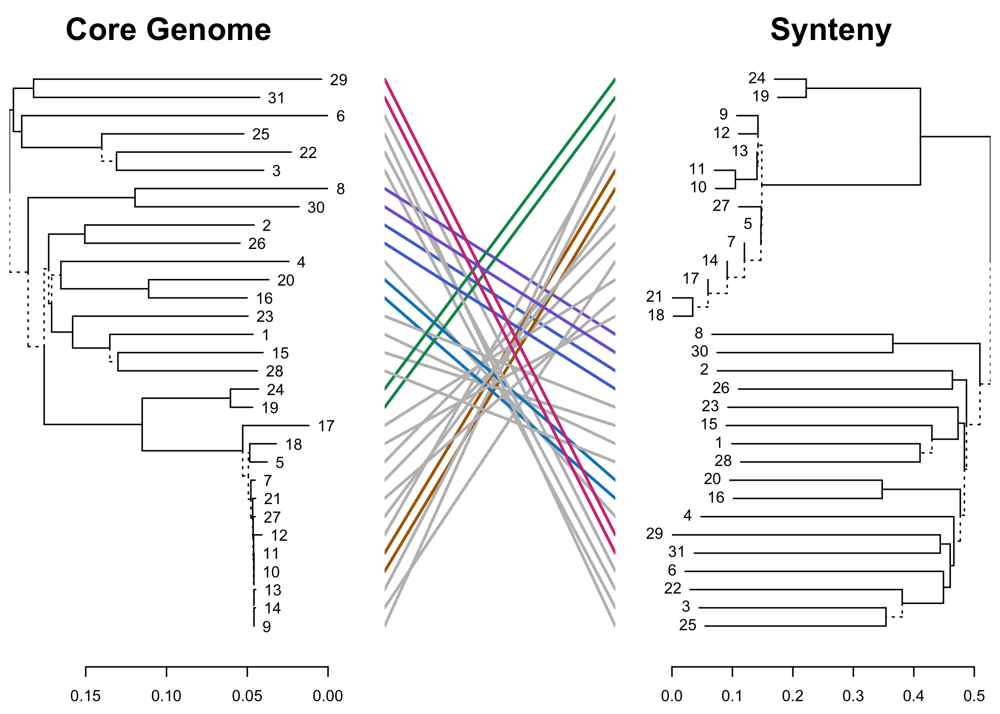

README
================
npc
2023-09-23

# Working With SynExtend

The SynExtend R package was originally built as a set of tools for
building out lists of orthologous gene pairs from biological data,
though it has since expanded. It is currently a work in progress. The
provided workflow here is a simple example built to showcase usage and
outputs of the orthology prediction tools housed within. The most
unfinished part of this workflow is in the `SelectByK` function that
uses a naive k-means approach to drop assumed false positive pairs.

The original idea of this work was to provide high quality orthology
inference tools to improve hypothesis generation post pair inference,
and this workflow will be updated as new use cases can be accessed with
these inferences. Currently the only task included here is a brief
observation of the placement of pseudogenes as a percentage of coding
genes on a phylogenetic tree.

## Initial workspace setup and known TODO list

This workflow is loading in four ad-hoc functions:

- An updated version of the function `SelectByK` within `SynExtend`.
- A function for providing context to orthologous pairs.
- A function that is serving as a helper for `gffToDataFrame` in lieu of
  it’s impending reformatting.
- A helper function for organizing the shared core orthologs.

A small TODO list for `SynExtend` includes updates to the function
`gffToDataFrame` to improve usage with eukaryotes generally and with
splice variants specifically, and adjustments to the `PairSummaries`
function to take advantage of forking within R and make slightly more
harmonious choices with pseudogene alignments.

``` r
# start the timer
TIMESTART <- Sys.time()

# load in some libraries 
suppressMessages(library(SynExtend))
suppressMessages(library(igraph))
suppressMessages(library(dendextend))

# chunk options
knitr::opts_chunk$set(eval = TRUE,
                      comment = "#",
                      fig.align = "center",
                      # out.width = "100%",
                      dpi = 300)

# SelectByK has had some minor adjustments, this imported version was added to v 1.13.5 (devel)
source(file = "R/SelectByK.R",
       echo = FALSE)
# The block size adjacency observer in PairSummaries() will eventually be superceded by this function
source(file = "R/BlockSize.R",
       echo = FALSE)
# a helper function
source(file = "R/GRangeToDFrame.R",
       echo = FALSE)
# a helper function
source(file = "R/AlignCore.R",
       echo = FALSE)
set.seed(1986)

# Sasha's distinct colors, hexcodes,
# from:
# https://sashamaps.net/docs/resources/20-colors/
ColVec1 <- c('#e6194B', '#3cb44b', '#ffe119', '#4363d8', '#f58231', '#42d4f4', '#f032e6', '#fabed4', '#469990', '#dcbeff', '#9A6324', '#fffac8', '#800000', '#aaffc3', '#000075', '#a9a9a9', '#ffffff', '#000000')
ColVec2 <- paste0(ColVec1,
                  "33")
ColVec3 <- paste0(ColVec1,
                  "50")
# specifically for the overlapping histogram
ColVec4 <- ColVec3[c(1:6, 13, 15, 18)]
```

## Data Collection Part 1

The NCBI [Edirect](https://www.ncbi.nlm.nih.gov/books/NBK179288/) tools
can be used to collect small or large sets of data, and are the only
non-R dependency in this workflow currently. In this case a small
example set of bacterial genomes and their annotations can be selected.
The genus currently denoted by the `Selection` variable in the code
chunk below was selected partially on a whim, but also partially because
it creates a modestly sized data set with a reasonable amount of
diversity, at least a few other convenient single genera sets like this
exist. This example workflow runs within a manageable time frame on a
MBP with modest specs. This initial data gathering step can be performed
in almost any manner generally, as long as matched FNA and GFF files are
the initial input to the workflow.

``` r
# using NCBI edirect tools to grab a small digestible test set
Selection <- "deinococcus"
EntrezQuery <- paste0("esearch -db assembly ",
                     "-query '",
                     Selection,
                     "[organism] ",
                     'AND "complete genome"[filter] ',
                     'AND "refseq has annotation"[properties] ',
                     "NOT anomalous[filter]' ",
                     '| ',
                     'esummary ',
                     '| ',
                     'xtract -pattern DocumentSummary -element FtpPath_RefSeq ',
                     'BioSampleAccn ',
                     'AssemblyStatus ',
                     'SubmitterOrganization ',
                     'SubmissionDate ',
                     'Organism ',
                     'Taxid ',
                     'SpeciesName ',
                     'ContigN50 ',
                     'ScaffoldN50 ',
                     'Coverage ',
                     '-block Stat -if "@category" -equals total_length -element Stat')
EntrezReply <- system(command = EntrezQuery,
                   intern = TRUE,
                   timeout = 500L)

dat1 <- strsplit(x = EntrezReply,
                 split = "\t",
                 fixed = TRUE)
dat1 <- do.call(rbind,
                dat1[lengths(dat1) == 12])
dat1 <- data.frame("FTP" = dat1[, 1L],
                   "Biosample" = dat1[, 2L],
                   "AssemblyStatus" = dat1[, 3L],
                   "SubmitterOrg" = dat1[, 4L],
                   "SubmissionDate" = dat1[, 5L],
                   "Organism" = dat1[, 6L],
                   "TaxID" = as.integer(dat1[, 7L]),
                   "SpeciesName" = dat1[, 8L],
                   "ContigN50" = as.integer(dat1[, 9L]),
                   "ScaffoldN50" = as.integer(dat1[, 10L]),
                   "Coverage" = as.numeric(dat1[, 11L]),
                   "TotalLength" = as.integer(dat1[, 12L]))

ReportedMethod <- ReportedTechnology <- vector(mode = "list",
                                               length = nrow(dat1))

pBar <- txtProgressBar(style = 1)
PBAR <- nrow(dat1)
for (m1 in seq_len(nrow(dat1))) {
  r1 <- readLines(paste0(dat1$FTP[m1],
                         "/",
                         strsplit(dat1$FTP[m1],
                                  split = "/",
                                  fixed = TRUE)[[1]][10],
                         "_assembly_report.txt"))
  ReportedMethod[[m1]] <- r1[grepl(pattern = "Assembly method",
                                   x = r1)]
  ReportedTechnology[[m1]] <- r1[grepl(pattern = "Sequencing technology",
                                       x = r1)]
  
  setTxtProgressBar(pb = pBar,
                    value = m1 / PBAR)
}
```

    # ================================================================================

``` r
close(pBar)
```

``` r
cat("\n")
```

``` r
# as of now, we care about Illumina, ONT, and PacBio (sorry to everyone else)
# these following asks are a little narrow, and will likely need to be made a bit
# more permissive to capture metadata better for less well behaved metadata submissions

# though we've captured assembly method, we're not using it here, but it will be left
# in the associated files on the repo
ONTPres <- sapply(X = ReportedTechnology,
                  FUN = function(x) {
                    any(grepl(pattern = "Nanopore",
                              x = x,
                              ignore.case = TRUE))
                  })
ILLPres <- sapply(X = ReportedTechnology,
                  FUN = function(x) {
                    any(grepl(pattern = "Illumina",
                              x = x,
                              ignore.case = TRUE))
                  })
PBPres <- sapply(X = ReportedTechnology,
                  FUN = function(x) {
                    any(grepl(pattern = "PacBio",
                              x = x,
                              ignore.case = TRUE))
                  })

SeqTechOpt <- c("ONT", "Ill", "PB")
SeqTech <- cbind("ONT" = ONTPres,
                 "Ill" = ILLPres,
                 "PB" = PBPres)
SeqTech <- apply(X = SeqTech,
                 MARGIN = 1,
                 FUN = function(x) {
                   if (any(x)) {
                     paste(SeqTechOpt[x],
                           collapse = " + ")
                   } else {
                     "Other"
                   }
                 })

dat1 <- cbind(dat1,
              "Technology" = SeqTech)

save(dat1,
     ReportedMethod,
     file = paste0("data/",
                   Selection,
                   "_metadata.RData"),
     compress = "xz")
```

## Data Collection Part 2

Pull the FNA and GFF files associated with the selected genomes, build a
DECIPHER DB, and manage the gene calls.

``` r
FtPPaths <- dat1$FTP

# grab associated FNAs and GFFs
FNAs <- unname(sapply(FtPPaths,
                      function(x) paste(x,
                                        "/",
                                        strsplit(x,
                                                 split = "/",
                                                 fixed = TRUE)[[1]][10],
                                        "_genomic.fna.gz",
                                        sep = "")))
GFFs <- unname(sapply(FtPPaths,
                      function(x) paste(x,
                                        "/",
                                        strsplit(x,
                                                 split = "/",
                                                 fixed = TRUE)[[1]][10],
                                        "_genomic.gff.gz",
                                        sep = "")))

GC01 <- vector(mode = "list",
               length = length(FNAs))

DBPATH <- paste0(getwd(),
                 "/data/",
                 Selection,
                 ".sqlite")

pBar <- txtProgressBar(style = 1)
PBAR <- length(FNAs)

for (m1 in seq_along(FNAs)) {
  
  Seqs2DB(seqs = FNAs[m1],
          type = "FASTA",
          dbFile = DBPATH,
          identifier = as.character(m1),
          verbose = FALSE)
  
  # a little funny business happens here because there's some work to do on the
  # functions used to munge GFFs into an object that's a little easier for us to
  # use
  # this funny business is only necessary if you're interested in the
  # pseudogene content of your dataset
  # if you're not:
  # GC01[[m1]] <- gffToDataFrame(GFF = GFFs[m1],
  #                       Verbose = FALSE)
  # will work just fine
  tmp1 <- tempfile()
  tmp2 <- paste0(tmp1,
                 ".gff.gz")
  download.file(url = GFFs[m1],
                destfile = tmp2,
                quiet = TRUE)
  
  ph1 <- rtracklayer::import(tmp2)
  ph1 <- GRangeToDFrame(GRangeObject = ph1,
                        Verbose = FALSE)
  ph2 <- gffToDataFrame(GFF = tmp2,
                        Verbose = FALSE)
  unlink(tmp2)
  
  # slam the feature notes onto ph2 as the final column and move on
  ph2 <- cbind(ph2,
               "Note" = ph1$Note[match(x = ph1$ID,
                                       table = ph2$ID)])
  
  GC01[[m1]] <- ph2
  
  setTxtProgressBar(pb = pBar,
                    value = m1 / PBAR)
}
```

    # ================================================================================

``` r
close(pBar)
```

``` r
cat("\n")
```

``` r
# if the sqlite DB is too large add it to the .gitignore file
# # do this at the end looping through all the generated files
# if (file.info(DBPATH)$size >= 25000000) {
#   
#   cat(paste0(DBPATH,
#              "\n"),
#       file = paste0(getwd(),
#                     "/.gitignore"),
#       append = TRUE)
#   
# }

names(GC01) <- seq(length(GC01))
```

## Build a Synteny Map

See the DECIPHER documentation for further reading. This is a modestly
diverse set of genomes within the same genera, and what we see subset of
the data in the below pairs plot, combined with a general summary of
syntenic hits is that though they share reasonable amounts of ordered
information, those individual blocks of order are still pretty
fractious. This is a modestly difficult test case for our tools in this
workflow.

``` r
Syn01 <- FindSynteny(dbFile = DBPATH,
                     verbose = TRUE,
                     processors = NULL)
```

    # ================================================================================
    # 
    # Time difference of 2099.64 secs

``` r
print(Syn01[1:5, 1:5])
```

    #             1           2           3           4        5
    # 1      5 seqs    23% hits    19% hits    25% hits 24% hits
    # 2 1114 blocks      6 seqs    20% hits    22% hits 24% hits
    # 3 1257 blocks 1318 blocks       1 seq    21% hits 18% hits
    # 4 1304 blocks 1783 blocks 1526 blocks     11 seqs 24% hits
    # 5 1356 blocks 1391 blocks 1268 blocks 1650 blocks   4 seqs

``` r
pairs(Syn01[1:5, 1:5])
```


## Build Predicted Pairs

Reconcile syntenic hits with gene calls to build out an initial list of
predicted pairs.

``` r
L01 <- NucleotideOverlap(SyntenyObject = Syn01,
                         GeneCalls = GC01,
                         LimitIndex = FALSE,
                         AcceptContigNames = TRUE,
                         Verbose = TRUE)
```

    # 
    # Reconciling genecalls.
    # ================================================================================
    # Finding connected features.
    # ================================================================================
    # Time difference of 4.274215 mins

``` r
P01 <- PairSummaries(SyntenyLinks = L01,
                     GeneCalls = GC01,
                     DBPATH = DBPATH,
                     PIDs = TRUE,
                     Score = TRUE,
                     Verbose = TRUE)
```

    # 
    # Preparing overhead data.

    # Warning in .Call2("DNAStringSet_translate", x, skip_code,
    # dna_codes[codon_alphabet], : in 'x[[2567]]': last base was ignored

    # Warning in .Call2("DNAStringSet_translate", x, skip_code,
    # dna_codes[codon_alphabet], : in 'x[[2703]]': last 2 bases were ignored

    # Warning in .Call2("DNAStringSet_translate", x, skip_code,
    # dna_codes[codon_alphabet], : in 'x[[4616]]': last base was ignored

    # Warning in .Call2("DNAStringSet_translate", x, skip_code,
    # dna_codes[codon_alphabet], : in 'x[[2920]]': last base was ignored

    # Warning in .Call2("DNAStringSet_translate", x, skip_code,
    # dna_codes[codon_alphabet], : in 'x[[2959]]': last 2 bases were ignored

    # Overhead complete.
    # Aligning pairs.
    # ================================================================================
    # Time difference of 2.670869 hours

``` r
hist(P01$PID, breaks = 100)
```


## State of the Data

Some of these predictions are good, some are bad, and we have somewhat
limited data available to evaluate these pairings. In the `P01` object,
columns 3-8 represent generalized information about the blocks of
information that led to the prediction, while columns 10, 11, and 12
represent general evaluations of the pairings themselves. The initial
object here is relatively large and pairs plots can be somewhat
excessive, so to avoid stressing out our graphics devices we will sample
only 50,000 rows.

``` r
head(P01)
```

    #       p1       p2 ExactMatch TotalKmers MaxKmer Consensus p1FeatureLength
    # 1  1_1_1  2_1_831        841         17     144 1.0000000            1140
    # 2  1_1_4 2_1_1944         23          1      23 0.6339827            2160
    # 3  1_1_5 2_1_2391         70          2      37 0.9878211             462
    # 4  1_1_6 2_1_2390        555         12      78 0.9964257             768
    # 5  1_1_9 2_1_2388        468          7     165 1.0000000             696
    # 6 1_1_10 2_1_3019         25          1      25 0.9108109             828
    #   p2FeatureLength Adjacent    TetDist        PID     SCORE PIDType PredictedPID
    # 1            1140        0 0.04775329 0.87894737 1802.8355      AA    0.8172217
    # 2             678        0 0.06135359 0.08815427 -143.8278      AA    0.1744101
    # 3             450        1 0.05846471 0.72077922  655.7183      AA    0.6158769
    # 4             762        1 0.05079629 0.82031250 1109.7355      AA    0.8259159
    # 5             696        0 0.06427434 0.84051724  981.8441      AA    0.8263651
    # 6            2169        0 0.05197594 0.10547945 -137.2877      AA    0.2876099

``` r
dim(P01)
```

    # [1] 1206331      14

``` r
pairs(P01[sample(x = nrow(P01),
                 size = 50000,
                 replace = FALSE),
          c(3:8, 10:12)], pch = 46)
```



## Evaluate Predicted Pairs

As seen in the above histogram, predicted pairs span the range of
available PIDs. Where users choose to threshold their PIDs is a
complicated series of value judgements based on their downstream needs,
and confidence preferences, however hard cutoffs are often inappropriate
for the data generated herein. To give users at least some tools to
avoid a hard threshold and effectively drop bad predictions, the
`SelectByK` function was constructed to use a K-means approach where
users provide a PID confidence that signifies the **lowest PID centroid
at which a cluster represents TRUE pairings**.

``` r
# the ReturnAllCommunities argument is set to TRUE here to allow us to illustrate
# where the function is dropping predicted pairs
P02 <- suppressWarnings(SelectByK(Pairs = P01,
                                  ClusterScalar = 4L, # default is 1, though that isn't likely to be aligned with user preferences
                                  UserConfidence = 0.5, # this is the PID that the cluster centroid must be above to be retained
                                  Verbose = TRUE,
                                  ShowPlot = TRUE,
                                  ReturnAllCommunities = TRUE))
```

    # ================================================================================


    # Time difference of 15.12634 mins

``` r
# reset GC01 with the attribute from the initial summaries, we're splitting these out in an attempt to keep our objects within reasonable size limits
GC01 <- attr(x = P01,
             which = "GeneCalls")
```

## Evaluated Clusters

We can evaluate the identified clusters with a histogram in relation to
the user cutoff and show the outcome of the selection. The total number
of clusters selected by `SelectByK` is a function of the `ClusterScalar`
argument and the initial input data.

``` r
P03 <- P02[[2]]
P02 <- P02[[1]]

plts <- vector(mode = "list",
               length = length(P03))
maxcounts <- vector(mode = "integer",
                    length = length(P03))
brks <- seq(from = 0,
            to = 1,
            by = 0.01)

for (m1 in seq_along(P03)) {
  plts[[m1]] <- hist(P03[[m1]][, "PID"],
                     breaks = brks,
                     plot = FALSE)
  maxcounts[m1] <- max(plts[[m1]]$counts)
}

o1 <- order(maxcounts, decreasing = TRUE)

plts <- plts[o1]

for (m1 in seq_along(plts)) {
  if (m1 > 1L) {
    plot(plts[[m1]],
         col = ColVec4[m1],
         add = TRUE)
  } else {
    plot(plts[[m1]],
         col = ColVec4[m1],
         xlab = "PID",
         ylab = "Frequency",
         main = "Clustered Predictions")
  }
}

abline(v = 0.5, lwd = 2.5, lty = 2)
```


``` r
rm(P03)
```

## Building a simple phylogeny

We can collect the single-linkage sets of pairs for further evaluation.
Though a variety of tools exist that allow us to perform community
detection on the single-linkage sets, we are foregoing them here for
simplicity. Some tools like [MCL](https://github.com/micans/mcl) perform
this task before proceeding to their algorithm, will others, like the
methods present in [igraph](https://igraph.org/) will attempt to
evaluate the entire graph they are given, regardless of whether
evaluations on distinct disjoint sets would be a more
resource-appropriate choice.

``` r
# this is a simple implementation of union-merge to get our disjoint sets
Sets01 <- DisjointSet(Pairs = P02,
                      Verbose = TRUE)
```

    # 
    # Assigning initial root:
    # ================================================================================
    # Time difference of 4.84664 secs
    # 
    # Assigning final root:
    #                                                                                 ================================================================================
    # Time difference of 0.4936399 secs
    # 
    # Assigning single linkage clusters.
    # Assignments complete.
    # 
    # Time difference of 5.607248 secs

``` r
attr(P02, "GeneCalls") <- GC01

# identify sets without paralogs
w1 <- sapply(X = Sets01,
             FUN = function(x) {
               y <- strsplit(x = x,
                             split = "_",
                             fixed = TRUE)
               y <- do.call(rbind,
                            y)
               nrow(y) == length(unique(y[, 1L]))
             },
             simplify = TRUE)

# extract out stringsets
PotentialCoreGenes <- ExtractBy(x = P02,
                                y = DBPATH,
                                z = Sets01[w1 & lengths(Sets01) == length(GC01)],
                                Verbose = TRUE)
```

    # 
    # Extracting Sequences:
    # ================================================================================
    # 
    # Arranging Sequences:
    # ================================================================================
    # 
    # Time difference of 5.550266 secs

``` r
# perform some alignments, grab some annotations, and create some dendrograms
CoreSet <- AlignCore(GeneCalls = GC01,
                     PotentialCoreGenes = PotentialCoreGenes,
                     Verbose = TRUE)
```

    # ================================================================================
    # 
    # Time difference of 7.462021 mins

``` r
# slam our core genes together and create a rough phylogeny
CoreGenome <- do.call(xscat,
                      CoreSet$Alignments)
CoreDist <- DistanceMatrix(myXStringSet = CoreGenome,
                           includeTerminalGaps = TRUE)
```

    # ================================================================================
    # 
    # Time difference of 1.61 secs

``` r
CoreDend <- TreeLine(myXStringSet = CoreGenome,
                     myDistMatrix = CoreDist,
                     method = "NJ",
                     showPlot = TRUE)
```

    # ================================================================================


    # 
    # Time difference of 0.02 secs

## Build another simple tree

We can proxy another dendrogram from the synteny map relatively easily,
and compare it to our core genome phylogeny. This specific example isn’t
a particularly useful exploration, but gives a brief example of how to
set up tree comparisons, and implement some tree distance comparisons in
`SynExtend`.

``` r
SynDist <- matrix(data = 0,
                  nrow = nrow(Syn01),
                  ncol = ncol(Syn01))
for (m1 in seq_len(nrow(Syn01) - 1L)) {
  for (m2 in (m1 + 1L):nrow(Syn01)) {
    y1 <- sum(Syn01[[m1, m1]])
    y2 <- sum(Syn01[[m2, m2]])
    ph1 <- 1 - ((sum(Syn01[[m1, m2]][, 4L]) * 2L) / (y1 + y2))
    if (ph1 < 1) {
      ph1 <- 0
    }
    SynDist[m1, m2] <- SynDist[m2, m1] <- 1 - ((sum(Syn01[[m1, m2]][, 4L]) * 2L) / (y1 + y2))
  }
}
SynDend <- TreeLine(myDistMatrix = SynDist,
                    method = "NJ")
```

    # ================================================================================
    # 
    # Time difference of 0.01 secs

``` r
tanglegram(dendlist(CoreDend %>% set("branches_lwd", 1),
                    SynDend %>% set("branches_lwd", 1)) %>% untangle(method = "ladderize"),
           common_subtrees_color_lines = TRUE,
           highlight_distinct_edges = TRUE,
           highlight_branches_lwd = TRUE,
           lwd = 2,
           main_left = "Core Genome",
           main_right = "Synteny")
```



``` r
paste("Clustering Information Distance ==",
      PhyloDistance(dend1 = CoreDend,
                    dend2 = SynDend,
                    Method = "CI"))
```

    # [1] "Clustering Information Distance == 0.558815440351137"

``` r
paste("Robinson-Foulds Distance == ",
      PhyloDistance(dend1 = CoreDend,
                    dend2 = SynDend,
                    Method = "RF"))
```

    # [1] "Robinson-Foulds Distance ==  0.535714285714286"

``` r
paste("Kuhner-Felsenstein Distance ==",
      PhyloDistance(dend1 = CoreDend,
                    dend2 = SynDend,
                    Method = "KF"))
```

    # [1] "Kuhner-Felsenstein Distance == 1"

``` r
paste("Jaccard-Rboinson-Foulds Distance ==",
      PhyloDistance(dend1 = CoreDend,
                    dend2 = SynDend,
                    Method = "JRF"))
```

    # [1] "Jaccard-Rboinson-Foulds Distance == -0.385662432962603"

``` r
fs_count <- sapply(X = GC01,
                   FUN = function(x) {
                     sum(grepl(pattern = "frameshifted", x = x$Note))
                   })
is_count <- sapply(X = GC01,
                   FUN = function(x) {
                     sum(grepl(pattern = "internal stop", x = x$Note))
                   })
coding_count <- sapply(X = GC01,
                       FUN = function(x) {
                         sum(x$Coding)
                       })

fs_per_feature <- fs_count / coding_count
is_per_feature <- is_count / coding_count
```

## Pseudogenes by phylogeny

We can visualize the percent of coding sequences with a noted internal
stop (blue) or frameshift (red) against our generated phylogeny, while
coloring the tips based on a rough extraction of the reporting
sequencing technologies used.

``` r
# give leaves a color attribute
LeafColByLabel <- function(x, y) {
  if (is.leaf(x)) {
    # is a terminal partition / leaf / tip
    label <- attr(x, "label")
    attr(x, "edgePar") <- list("col" = y[names(y) == label])
  }
  x
}
labkey1 <- grepl(pattern = "ONT",
                 x = dat1$Technology)
labkey2 <- grepl(pattern = "PP",
                 x = dat1$Technology)
labkey3 <- grepl(pattern = "Ill",
                 x = dat1$Technology)

labkey4 <- rep(1, length(labkey1))
labkey4[labkey1] <- 2
labkey4[labkey2] <- 3
labkey4[labkey3] <- 4
labkey4[labkey1 & labkey3] <- 5
labkey4[labkey2 & labkey3] <- 6
Labs <- as.integer(labels(CoreDend))
Labs2 <- ColVec1[labkey4]
names(Labs2) <- Labs

layout(mat = matrix(data = 1:2,
                    ncol = 1))
par(mar = c(0, 2.95, 2, 0.05))
plot(dendrapply(X = CoreDend,
                FUN = function(x) {
                  LeafColByLabel(x = x, y = Labs2)
                }),
     nodePar = list(lab.cex = NA,
                    pch = NA),
     axes = FALSE,
     main = "Deinococcus Pseudogenes")
legend("topright",
       legend = c("Other",
                  "ONT",
                  "PacBio",
                  "Illumina",
                  "Illumina + ONT",
                  "Illumina + PacBio"),
       col = ColVec1[1:6],
       lty = 1,
       bg = NA,
       bty = "n",
       cex = 0.75)
# abline(v = 1) # you can use these to align the two plots!
# abline(v = 31)
par(mar = c(3, 2.95, 0, 0.05),
    mgp = c(1.55, .75, 0))
plot(x = 0,
     y = 0,
     axes = FALSE,
     frame.plot = FALSE,
     xlim = c(0.5, max(Labs) + 0.5),
     ylim = c(-0.04, 0),
     ylab = "% Pseudo Coding",
     xlab = "",
     type = "n")
axis(side = 2,
     at = seq(from = -0.04,
              to = 0,
              by = 0.01),
     labels = seq(from = 4,
                  to = 0,
                  by = -1))
# abline(v = 1) # you can use these to align the two plots!
# abline(v = 31)
o1 <- match(x = seq_along(fs_per_feature),
            table = Labs)
p1 <- fs_per_feature[o1] > is_per_feature[o1]
for (m1 in seq_along(fs_per_feature)) {
  rect(ybottom = -fs_per_feature[o1[m1]],
       ytop = 0,
       xleft = m1 - 0.48,
       xright = m1,
       xpd = TRUE,
       col = "red",
       border = NA)
  rect(ybottom = -is_per_feature[o1[m1]],
       ytop = 0,
       xleft = m1,
       xright = m1 + 0.48,
       xpd = TRUE,
       col = "blue",
       border = NA)
}
```


## Current End of workflow

Save off our data, add anything that is too large for github our
`.gitignore` file, and print out some session information. From here
data like this is in a reasonable state to use for a variety of
downstream computational biology tasks. As more functionality is added
to `SynExtend`, more examples and plots will be added to this repo.
Currently this workflow is easily manageable on a recent model Macbook
Pro with 12 Cores and 64GB of RAM.

``` r
TIMEEND <- Sys.time()
# total time for the entire workflow
print(TIMEEND - TIMESTART)
```

    # Time difference of 4.03856 hours

``` r
# our genecalls
save(GC01,
     file = paste0("data/",
                   Selection,
                   "_genecalls.RData"),
     compress = "xz")
save(Sets01,
     file = paste0("data/",
                   Selection,
                   "_sets.RData"))
# in an attempt to make our items manageable for github we're stripping out the genecalls
# and saving them separately
attr(P02, "GeneCalls") <- NULL
save(P02,
     file = paste0("data/",
                   Selection,
                   "_pairs.RData"),
     compress = "xz")
save(Syn01,
     file = paste0("data/",
                   Selection,
                   "_syn.RData"),
     compress = "xz")
save(L01,
     file = paste0("data/",
                   Selection,
                   "_links.RData"),
     compress = "xz")
save(CoreSet,
     file = paste0("data/",
                   Selection,
                   "_core.RData"))

GeneratedData <- list.files("data")
if (file.exists(".gitignore")) {
  CurrentGitIgnore <- readLines(".gitignore")
} else {
  CurrentGitIgnore <- ""
}

# look through the data files and add anything that's too large to the gitignore file
for (m1 in seq_along(GeneratedData)) {
  CurrentEval <- paste0("data/",
                       GeneratedData[m1])
  
  if (file.info(CurrentEval)$size >= 25000000 &
      !(CurrentEval %in% CurrentGitIgnore)) {
    cat(paste0("data/",
               GeneratedData[m1],
               "\n"),
        file = ".gitignore",
        append = TRUE)
  }
}

sessionInfo()
```

    # R version 4.3.0 (2023-04-21)
    # Platform: x86_64-apple-darwin20 (64-bit)
    # Running under: macOS Monterey 12.4
    # 
    # Matrix products: default
    # BLAS:   /Library/Frameworks/R.framework/Versions/4.3-x86_64/Resources/lib/libRblas.0.dylib 
    # LAPACK: /Library/Frameworks/R.framework/Versions/4.3-x86_64/Resources/lib/libRlapack.dylib;  LAPACK version 3.11.0
    # 
    # locale:
    # [1] en_US.UTF-8/en_US.UTF-8/en_US.UTF-8/C/en_US.UTF-8/en_US.UTF-8
    # 
    # time zone: America/New_York
    # tzcode source: internal
    # 
    # attached base packages:
    # [1] parallel  stats4    stats     graphics  grDevices utils     datasets 
    # [8] methods   base     
    # 
    # other attached packages:
    #  [1] dendextend_1.17.1   igraph_1.4.2        SynExtend_1.12.0   
    #  [4] DECIPHER_2.28.0     RSQLite_2.3.1       Biostrings_2.68.0  
    #  [7] GenomeInfoDb_1.36.0 XVector_0.40.0      IRanges_2.34.0     
    # [10] S4Vectors_0.38.1    BiocGenerics_0.46.0
    # 
    # loaded via a namespace (and not attached):
    #  [1] SummarizedExperiment_1.30.1 gtable_0.3.3               
    #  [3] rjson_0.2.21                xfun_0.39                  
    #  [5] ggplot2_3.4.2               lattice_0.21-8             
    #  [7] Biobase_2.60.0              vctrs_0.6.2                
    #  [9] tools_4.3.0                 bitops_1.0-7               
    # [11] generics_0.1.3              tibble_3.2.1               
    # [13] fansi_1.0.4                 highr_0.10                 
    # [15] blob_1.2.4                  pkgconfig_2.0.3            
    # [17] Matrix_1.5-4                lifecycle_1.0.3            
    # [19] GenomeInfoDbData_1.2.10     compiler_4.3.0             
    # [21] Rsamtools_2.16.0            munsell_0.5.0              
    # [23] codetools_0.2-19            htmltools_0.5.5            
    # [25] RCurl_1.98-1.12             yaml_2.3.7                 
    # [27] pillar_1.9.0                crayon_1.5.2               
    # [29] BiocParallel_1.34.1         DelayedArray_0.26.2        
    # [31] cachem_1.0.8                viridis_0.6.3              
    # [33] tidyselect_1.2.0            digest_0.6.31              
    # [35] dplyr_1.1.2                 restfulr_0.0.15            
    # [37] fastmap_1.1.1               grid_4.3.0                 
    # [39] colorspace_2.1-0            cli_3.6.1                  
    # [41] magrittr_2.0.3              S4Arrays_1.0.1             
    # [43] XML_3.99-0.14               utf8_1.2.3                 
    # [45] scales_1.2.1                bit64_4.0.5                
    # [47] rmarkdown_2.21              matrixStats_0.63.0         
    # [49] bit_4.0.5                   gridExtra_2.3              
    # [51] memoise_2.0.1               evaluate_0.21              
    # [53] knitr_1.42                  GenomicRanges_1.52.0       
    # [55] BiocIO_1.10.0               viridisLite_0.4.2          
    # [57] rtracklayer_1.60.0          rlang_1.1.1                
    # [59] glue_1.6.2                  DBI_1.1.3                  
    # [61] rstudioapi_0.14             R6_2.5.1                   
    # [63] MatrixGenerics_1.12.0       GenomicAlignments_1.36.0   
    # [65] zlibbioc_1.46.0
